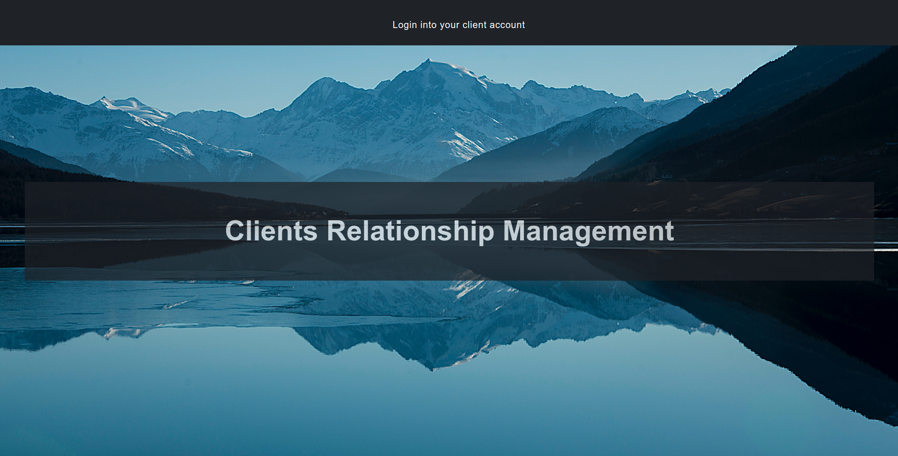
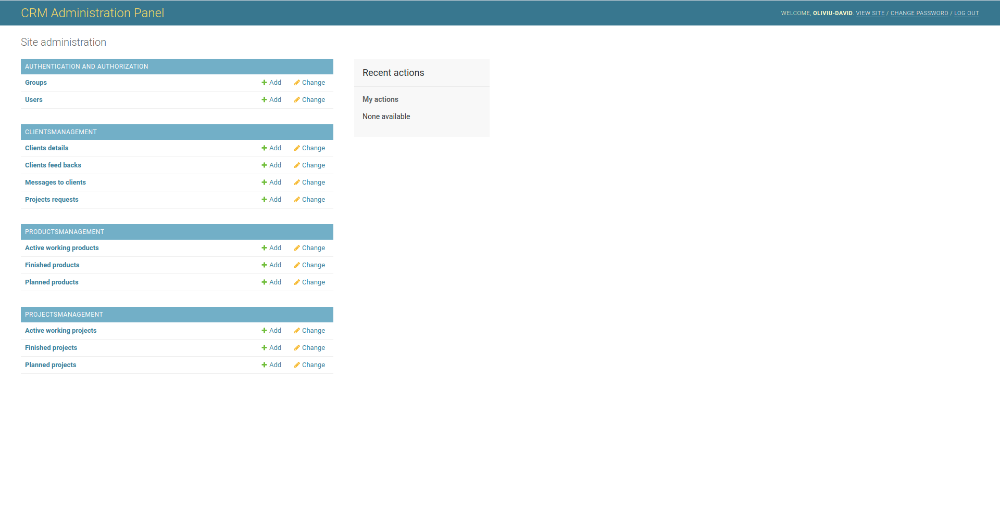
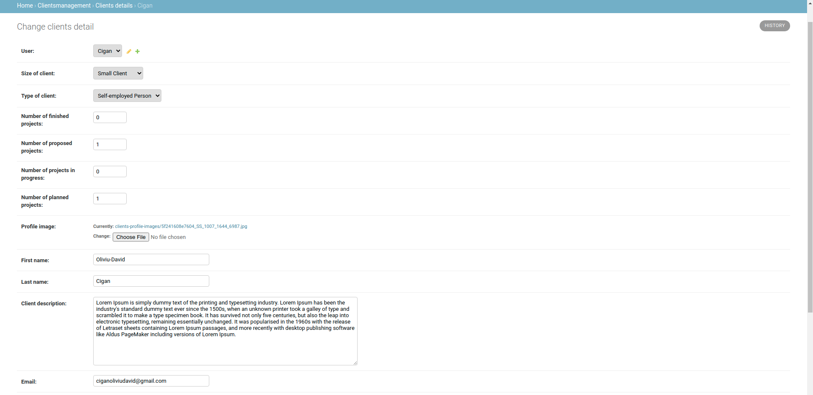
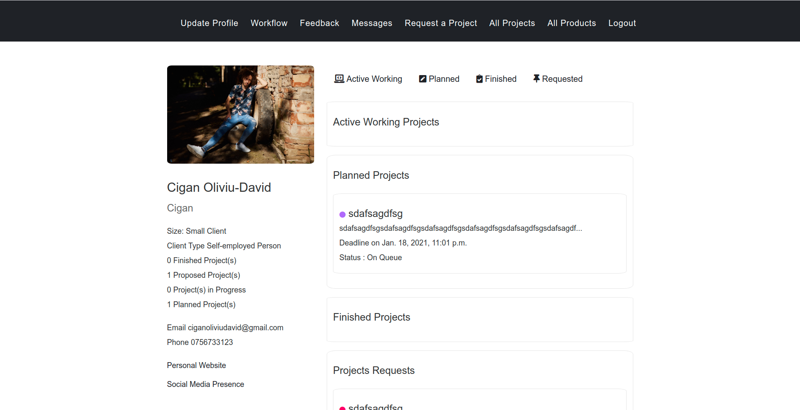
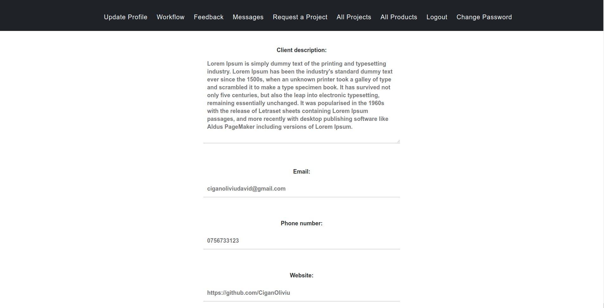
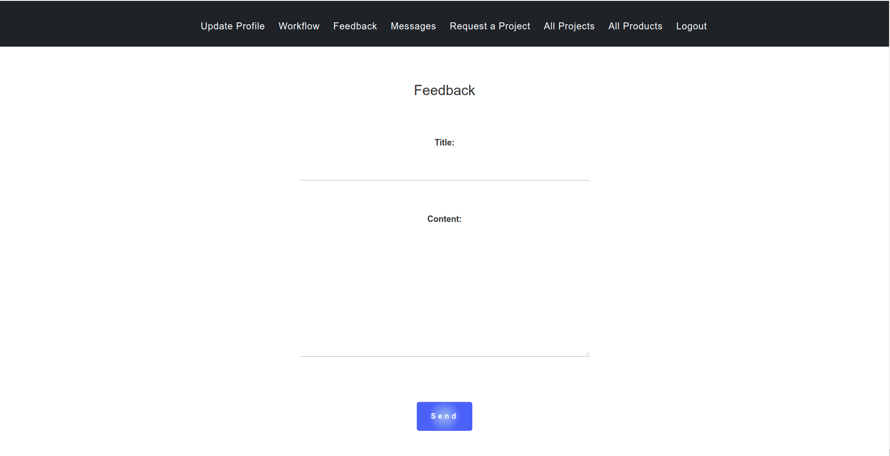
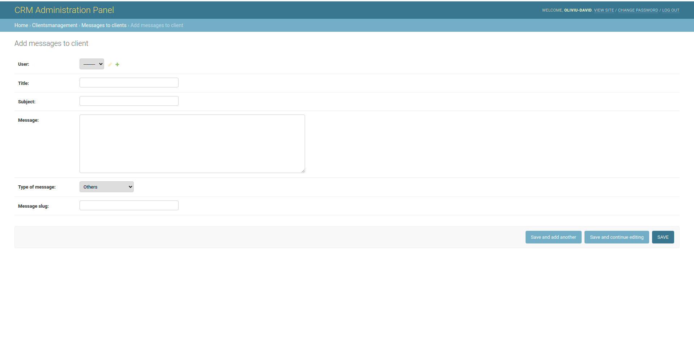

# CustomerRelationshipManagement

This CRM represents my way of administrating clients and the projects they
request. It includes an authentication system into the platform, projects 
request possibilities, real time check of the status of the working project,
included mailing system for a quicker intercommunication between client and
business owner and others.

## Backend

Every part of the webapp is administrated from a control panel as shown
below.

##### AUTHENTICATION AND AUTHORIZATION

This database all the clients of the business with basic details needed
for the authentication system. It includes last_login, last_logout and others.

A reset password system is also present, it works by sending an email to the
user with a link to the reset password form.

##### CLIENTSMANAGEMENT

The clients management database includes four different tables..

##### Clients details

This table includes different informations about any specific client who
has an account in the platform. Information like size of the client, type of the client,
number of finished, proposed or planned projects even the projects who are
in progress of development. It also includes a profile image, a short description,
email, phone number, social media presence and personal website. The structure can be seen
below.

This information is used not only for the business but also to create 
a profile of the client in the UI through CRUD operations.

All this information is introduced by the client itself through a form. He
is also the one who can actualise all this data from a simple form.

This part of the webapp also includes a password change system which simply
redirects the user to a form for changing the password.

##### Clients feedbacks 

This table represents messages from the clients about how the project is
working after it was delivered but not only that. It is also about any comments
that the user wants to make about services, workflow, quality, pretty much
everything the business is responsible. The feedback is sent through a form
directly in the database where it can be read by the business owner or 
platform administrator.

##### Messages to clients

 This table represents the big part of the mailing system from the platform.
 Here, the business owner is able to write any mails to any client about specific
 topics such as project references, workflow references or others.
 

All the mails who are sent to the user are just crud operations in the UI with specific 
filters.

As it can been seen there are 5 different filters and those are all messages, last messages,
messages, about projects, messages about workflow and other messages. The user (client) can go to any 
of those elements from the submenu to get quicker to the messages he wants to read or check.